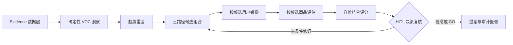

# Trend2SKU 方法论白皮书

> 版本：v1，2026-07-19。面向名创优品「趋势感知 → 产品创意 → 上市验证」命题。当前仓库可证明工程链路可运行，不能证明单品销量、毛利、爆款概率或投资回报。

## 1. 决策问题，而非创意问题

2025 年年报披露 MINISO 平均每月推出约 1,600 个 SKU，并已拥有 Smart Merchandise Selection Assistant 与产品生命周期管理系统；2026 年 3 月季度末，MINISO 门店为 8,210 家，其中海外 3,617 家。[F1][F2] 因此，本方案不把企业描述成“没有数字化”，也不再做一个孤立的创意生成器。它补的是决策连接层：让多来源证据、候选组合、验证结果、商品风险、统一量表和人工复核在同一条可审计链路上相遇。

系统遵循四个原则：

1. **先组合、后收敛**：每轮至少保留 VOC、趋势、竞品白空间三条不同路径，避免第一个看似合理的创意占满讨论空间。
2. **数值确定、叙述可增强**：评分、权重、阈值和风险闸口由代码控制；当前大模型只润色提案摘要，不能自由改分。
3. **证据与候选同 ID**：`concept_id` 贯穿候选、模拟访谈、商品评估、评分、决策和提案；可见论断使用 `evidence_ids` 解析回来源。
4. **离线先验收、真实再校准**：合成样本只证明流程、接口和不变量；业务判断必须在数据授权后通过影子试点、实物小样和门店实验建立。

## 2. 三条候选路径

| 路径 | 主要输入 | 解决的问题 | 典型产物 | 防止的偏差 |
|---|---|---|---|---|
| VOC 需求路径 | 方面统计、高机会需求、代表证据 | 用户在哪些体验上仍有未满足空间 | 从明确痛点反推的实用候选 | 只追热点、忽视使用问题 |
| 趋势主题路径 | 官方经营信号、经许可的公开趋势、IP 与本地化约束 | 哪些主题值得快速形成测试品 | 强主题、系列化、可传播候选 | 只看历史评论、错过新信号 |
| 竞品白空间路径 | 可比品牌方面差异、包装与功能空白 | 哪些价值尚未被充分占据 | 结构或场景差异候选 | 同质化跟随、只做表面联名 |

三条路径不是三次随机生成。离线模式调用 `generate_candidate_portfolio`，以结构化机会、趋势、白空间和上一轮修订上下文生成稳定候选；当前在线模式也不改变候选数值，未来若增加模型批判，仍须满足 ID 唯一、字段完整和证据可解析等契约。

## 3. 六类 Agent 能力

| 能力 | 读取 | 实际工具或确定性模块 | 交付 |
|---|---|---|---|
| 趋势雷达 Agent | 官方信号、证据索引、竞品方面 | `get_retail_trends`、`search_retail_evidence` | 趋势、竞品拆解、白空间 |
| 用户镜像 Agent | 候选、方面机会、检索证据 | `search_retail_evidence` | 按候选隔离的模拟访谈、异议与接受度 |
| 创意工坊 Agent | 三路径输入、修订约束 | `generate_candidate_portfolio` | 至少三个不同候选 SKU |
| 商品专家 Agent | 候选结构、证据、质量与授权规则 | `assess_merchandise_candidate` | 毛利潜力、供应链、IP、合规、本地化与风险 |
| 爆款评审 Agent | 所有候选验证结果 | `score_candidate_portfolio` | 八维评分卡、稳定排序、GO 建议 |
| 提案生成 Agent 能力 | 榜首、风险、证据和决策 | 确定性提案节点，在线时仅润色叙述 | PR/FAQ、风险条件与决策摘要 |

这里的“Agent”指在受控工作流中拥有明确职责、状态和工具边界的能力单元，不等于六个模型自由对话。OpenAI 的构建指南建议只在工作流确实需要时增加编排复杂度；Anthropic 的多 Agent 文章也强调协调与评测成本。[A1][A5] 所以本系统把洞察统计、评分和硬闸保留为确定性模块，当前只用模型增强榜首提案叙述；未来增加归纳或批判也不得绕过这些边界。

## 4. 工具调用与可观测性

Agent 通过注册表获取只读工具，而不是直接绕过接口调用底层函数。每次调用都校验工具类型和输出结构，并记录：节点名、工具名、成功或错误、是否使用 fallback、输入输出的类型/数量摘要。完整敏感文本、令牌、密钥和凭据不得进入外部 trace。

离线运行即使没有远程模型也会真实经过工具注册表；这使“断网可复现”和“确实调用了工具”可以同时成立。该设计参考 Function Calling 的结构化接口原则和 tracing 的 span 思想，但本项目实现的是自有轻量 JSONL tracer，并不声称直接采用 OpenAI Agents SDK。[A2][A3] 工具质量通过回归测试、错误 fallback 和输出不变量迭代，不把底层 API 原样暴露给 Agent。[A6]

## 5. 八维确定性评分

每个候选都有八个 `0–100` 子分，总权重精确为 100%：

| 维度 | 权重 | 主要输入 |
|---|---:|---|
| 趋势匹配 | 20% | 已采集趋势命中，不等同市场热度绝对值 |
| 需求强度 | 20% | 机会排序与模拟接受度；接入真实研究后重新校准 |
| 差异化 | 15% | 可解释差异点与白空间 |
| 社交传播 | 15% | 展示、系列化和分享意愿假设 |
| 成本与毛利 | 10% | 目标价格带、物料复杂度和企业成本输入 |
| 供应链可行性 | 10% | 工艺、供应商成熟度、交期和小批量复杂度 |
| IP/合规 | 5% | 授权地域/品类/期限、质量和区域规则 |
| 全球本地化 | 5% | 共用结构、区域内容层和当地文化适配 |

总分为 `Σ(子分 × 权重)`，保留两位小数。建议阈值为：`>=75` 为 `GO`，`60–74.99` 为 `CONDITIONAL_GO`，`<60` 为 `NO_GO`。严重 IP 或质量风险即使总分达到 75，也不得直接 `GO`。`82.25/100` 只表示在当前量表和输入下的相对优先级，不是 82.25% 的爆款概率。

## 6. 工作流与状态契约

状态对象同时保存所有候选和按 `concept_id` 隔离的评估结果。每次重新生成候选时，上一轮候选相关论断会从评分输入中清除，只把异议、必须修改项、决策条件和风险作为审计上下文传入，防止“把反馈文字堆多就涨分”。同分时按 `concept_id` 升序稳定决胜，保证相同输入得到同一榜首。

## 7. HITL 与风险闸口

启用 `MINISO_HITL=true` 后，状态图在决策复核节点前持久化 checkpoint。人工可检查榜首、八维分数、授权与质量风险、模拟访谈异议及证据，再显式 `approve` 继续；同一 thread 的重复运行和并发恢复会被拒绝。HITL 不是给模型结论盖章，而是把责任边界放回商品、法务、质量和区域经营人员。

上线前至少需要四类人工签核：数据用途与保留期限、IP 权利链和宣传边界、材料/结构质量与区域合规、价格/BOM/毛利口径。任何严重红线都应覆盖综合分，不能用高趋势分抵消。

## 8. 数据治理与引用

数据分为三层：公开信息、获授权企业数据、合成演示数据。公开信息要保存 URL、日期与允许用途；企业数据按最小必要、脱敏、访问控制和留存期限接入；合成数据始终标记 `synthetic_demo`。仓库中的 400 条评论由固定种子 `20260719` 生成，MINISO 140 条，四个演示竞品各 65 条，仅用于 ABSA、检索、排序和接口测试。

官方经营数字可以说明决策规模与约束，却不能直接成为单品需求证据。例如，授权费用增长只能说明费用变化及公司披露的战略投入，不能写成 IP 收入或消费者需求增长。评论证据、趋势证据和企业经营事实应在视图中保留不同来源标签。

## 9. 校准与评测

Agent 评测要同时看 trajectory 与 outcome。[A4] 本项目分四层校准：

1. **单元契约**：权重、阈值、严重风险保护、ID 关联、工具类型和输出字段。
2. **离线回归**：固定输入多次运行，检查候选数量、榜首稳定性、引用解析、trace 和报告边界。
3. **影子试点**：在不影响真实立项的情况下，让专家组和系统处理同题、同数据、同预算 brief，比较排序一致率、证据完整率、风险召回与决策耗时。
4. **业务 outcome**：通过实物小样、盲测、门店或区域对照，测量小样通过率、首批售罄/售罄速度、折扣率、退货质量、毛利和库存周转；不使用模拟接受度替代。

每次品类、区域、价格带或模型变化都可能造成分布漂移。阈值只有在足够数量的历史候选与真实 outcome 可用后才校准，并保留版本、训练/验证时间窗和回测记录。

## 10. 价值指标分层

| 层级 | 可以现在声明什么 | 不能声明什么 |
|---|---|---|
| 已验收工程指标 | 每轮 3 个候选、每候选 8 维、权重 100%、稳定榜首、工具 trace、引用可解析、CLI/API/HITL 可运行 | 不能说已提升销量、毛利或爆款命中率 |
| 企业审计后锁定的试点目标 | groundedness、citation hit、专家一致率、风险召回、进入小样率、决策周期；先测基线再签目标 | 不能把离线分数当成试点结果 |
| 最终业务结果 | 定义同店同窗或随机区域实验，测售罄、折扣、退货、毛利、周转和复购 | 没有真实对照前不写提升百分比或 ROI |

## 11. 非目标

- 不替代商品委员会、产品经理、设计师、供应商、质量、法务或区域经营团队。
- 不从公司规模、授权费用或社交内容直接推断某个 SKU 会成为爆款。
- 不把合成用户当真实用户，不把模拟接受度当试购，不把模拟 NPS 当上市后 NPS。
- 不让远程模型控制数值评分、审批写操作或严重风险豁免。
- 不承诺自动抓取任何公开页面；数据源必须先确认条款、授权、隐私和使用范围。
- 不在缺少原代码许可时宣称整个仓库可自由复制或公开再分发。

## 12. 资料索引

文中的 `[F1]–[F3]` 与 `[A1]–[A6]` 对应 `docs/references.md`。迁移代码的授权阻断条件见 `docs/迁移说明.md`；同题影子试点的详细方案见 `docs/ai_vs_experience.md`。
